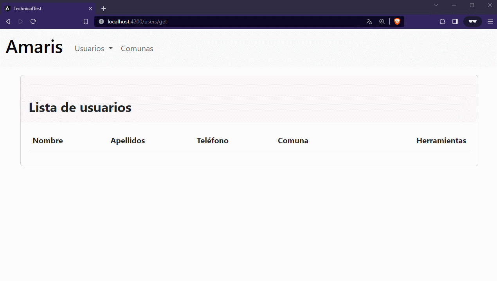

# Technical Test

## Requirements

This project was generated with [Angular CLI](https://github.com/angular/angular-cli) version 15.2.9.

## Development server

Run `ng serve` for a dev server. Navigate to `http://localhost:4200/`. The application will automatically reload if you change any of the source files.

## Contributing

If you'd like to contribute to this documentation, please follow these steps:

1. Fork this repository to your own GitHub account.
2. Create a new branch with a descriptive name for your changes.
3. Make your changes and commit them to your branch.
4. Push your branch to your forked repository.
5. Open a pull request from your branch to this repository's `main` branch.
6. Your changes will be reviewed and merged if they meet the project's standards.

## Credits

This project is developed and maintained by [Manuel Gil](https://github.com/ManuelGil).
